# Expense Manager 💰

A **Full Stack Expense Manager Application** built using **React.js**, **Spring Boot**, and **MySQL**. This application helps users track income and expenses, analyze spending habits, manage scheduled transactions, and securely maintain their financial data.

---
## 🌐 Live Application

🔗 Frontend (Netlify)
https://expensesmanagerapplication.netlify.app

🔗 Backend (Render)
https://expensemanager-backend-zkl3.onrender.com

🔗 Swagger API Docs  
https://expensemanager-backend-zkl3.onrender.com/swagger-ui/index.html

## 🎥 Demo Video

▶ Demo Walkthrough:
https://drive.google.com/file/d/1ufPrDSkMk44gXrv12UOg5PrTXBl0ZwSU/view?usp=drive_link

## 📌 Features

### 🔐 Authentication & Security

* User Signup & Login (JWT-based authentication)
* Forgot Password & Reset Password via Email
* OAuth2 Login (Google, Facebook, LinkedIn)
* Secure password encryption (BCrypt)

### 💸 Expense Management

* Add, Edit, Delete Expenses
* Categorize expenses (Food, Travel, Medical, etc.)
* Support for both **Income** and **Expense** types
* Search transactions by keyword
* Filter by date, category, and range

### 📊 Analytics & Insights

* Total Income, Total Expense, and Balance
* Category-wise expense analysis (Pie Chart)
* Date / Week / Month / Year based analysis

### 🔁 Scheduled Transactions

* Create recurring transactions (Daily / Monthly etc.)
* Mark scheduled transactions as completed
* Separate view for upcoming and completed transactions

### 👤 User Profile

* View & Update Profile
* Upload / Remove Profile Picture
* Delete Account

### 📞 Support & Feedback

* Contact Us form
* Support & Feedback with attachments and ratings

### 🧭 Extra Pages

* FAQ
* About App
* Privacy Policy
* Terms of Service
* Go Premium (UI-ready)

### 🚀 Production Ready Features

* Cloud Deployment (Render + Netlify)
* Secure Environment Variables
* OAuth2 Social Login Integration
* JWT Secure Authentication
* Dockerized Application
---

## 🧱 Tech Stack

### Frontend

* React.js
* React Router
* Axios
* Recharts
* CSS

### Backend

* Spring Boot
* Spring Security
* JWT Authentication
* OAuth2
* JPA / Hibernate
* Swagger (OpenAPI 3)

### Database

* MySQL

### DevOps / Deployment

* Docker
* Docker Compose
* Nginx
* Render (Backend Hosting)
* Netlify (Frontend Hosting)

---

## 📁 Project Structure

```
EXPENSE MANAGER/
├── expense-manager-frontend/
│   ├── src/
│   │   ├── components/
│   │   ├── pages/
│   │   ├── services/
│   │   ├── utils/
│   │   └── App.js
│   ├── Dockerfile
│   └── package.json
│
├── ExpenseManagerBackend/
│   ├── ExpenseManagerBackend-main/
│   │   ├── controller/
│   │   ├── entity/
│   │   ├── repository/
│   │   ├── service/
│   │   ├── security/
│   │   └── ExpenseManagerBackendApplication.java
│   ├── Dockerfile
│   └── pom.xml
│
├── docker-compose.yml
└── README.md
```

---

## 🗄️ Database Design

### Tables

* users
* expenses
* scheduled_transactions
* support_tickets
* contact_messages

### Relationships

* One User → Many Expenses
* One User → Many Scheduled Transactions
* One User → Many Support Tickets
* Contact Messages are independent

---

## 🔗 API Documentation (Swagger)

### 🌐 Live Swagger (Production)

https://expensemanager-backend-zkl3.onrender.com/swagger-ui/index.html

---

### 🖥️ Local Swagger (Development)

After running backend locally:

http://localhost:8080/swagger-ui.html

OR

/v3/api-docs

```

---

## ▶️ How to Run the Project

### Using Docker (Recommended)

```bash
docker-compose up --build
```

### Manual Setup

#### Backend

```bash
cd ExpenseManagerBackend/ExpenseManagerBackend-main
mvn spring-boot:run
```

#### Frontend

```bash
cd expense-manager-frontend
npm install
npm start
```

---

## 👨‍💻 Developer

**Makarand Goralkar**
Full Stack Developer
📧 [makarandgoralkar27@gmail.com](mailto:makarandgoralkar27@gmail.com)

---

## 📄 License

This project is developed for learning and demonstration purposes.

© 2026 Makarand Goralkar. All rights reserved.

## 📸 Screenshots

> Below are key screens of the Expense Manager application. Replace placeholders with actual screenshots.

### 🔐 Authentication

* **Login Page** – Secure login with email/password and OAuth2 (Google, Facebook, LinkedIn)

  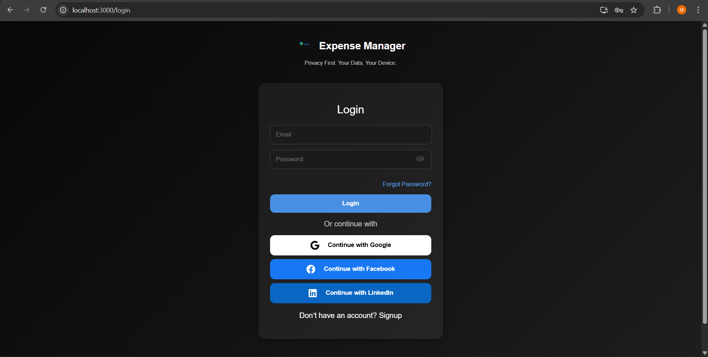


* **Signup Page** – New user registration with validation

  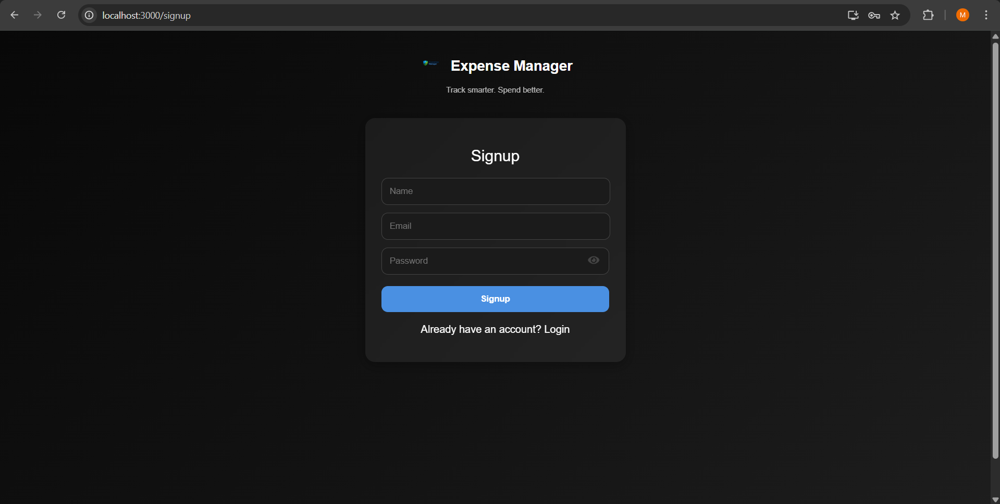


* **Forgot Password Page** – Reset password via email  

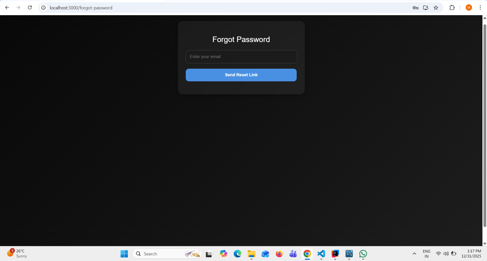


### 🏠 Dashboard

* **Home Dashboard** – Overview of balance, income, expenses, and recent transactions

  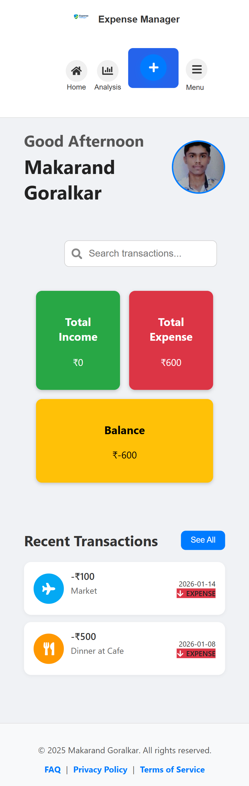


### 💸 Transactions

* **All Transactions** – View, search, and filter transactions

  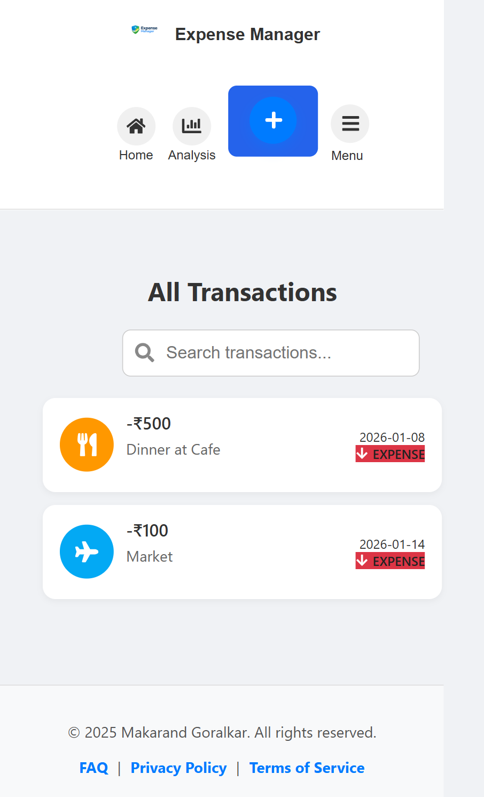


* **Add Transaction** – Add income or expense with category and date

  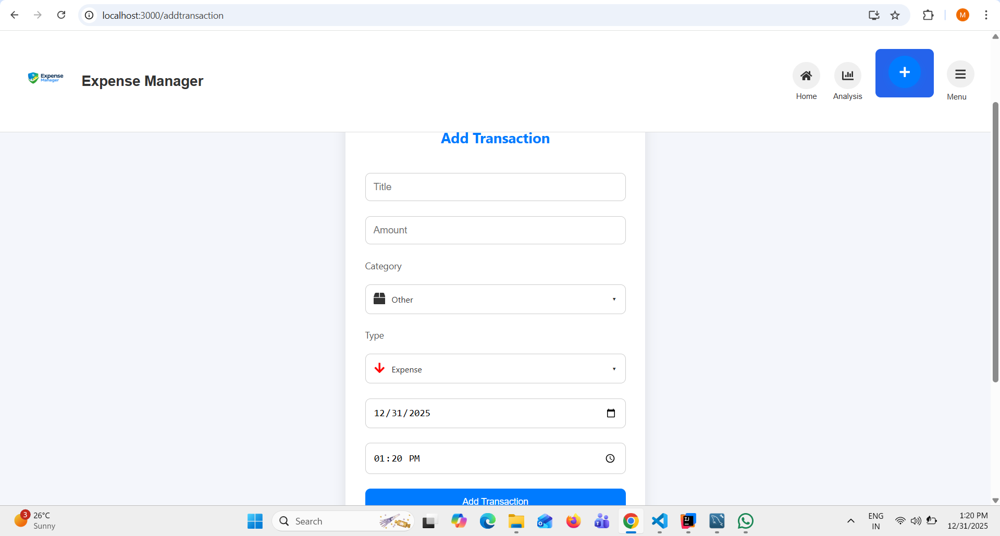


* **Edit Transaction** – Update or delete an existing transaction

  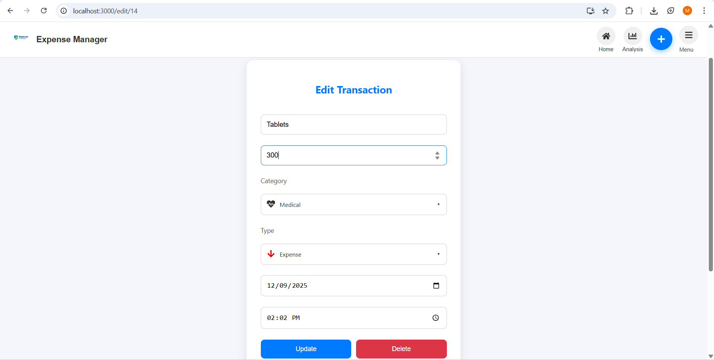


### 📊 Analytics

* **Analysis Page** – Category-wise spending and financial summary

  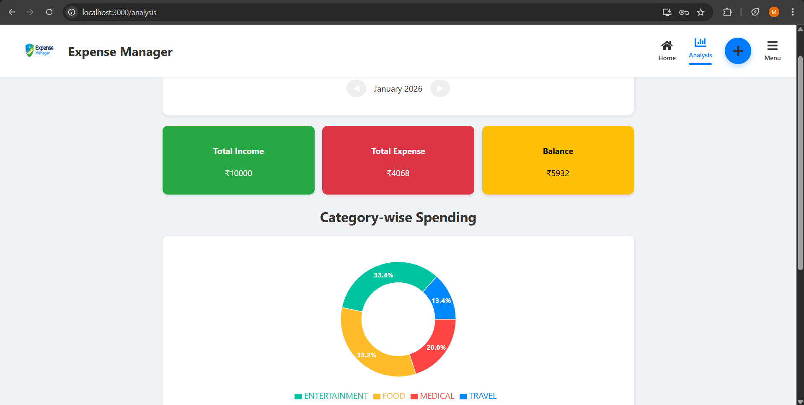


### 🔁 Scheduled Transactions

* **Scheduled Transactions List** – View upcoming and completed scheduled payments

 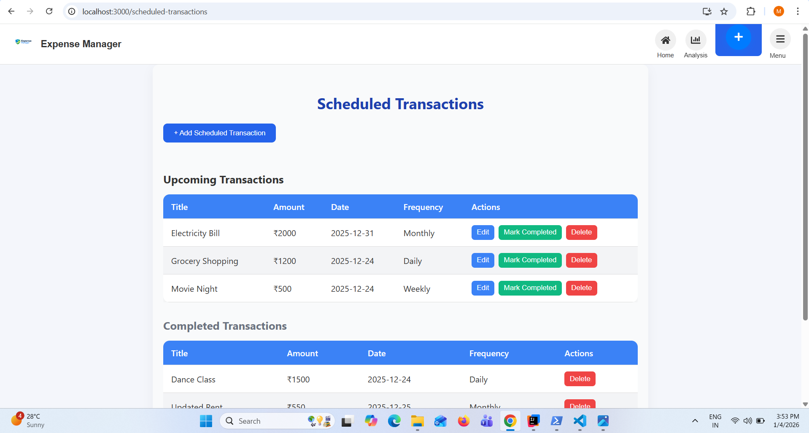


* **Add Scheduled Transaction** – Create recurring transactions

  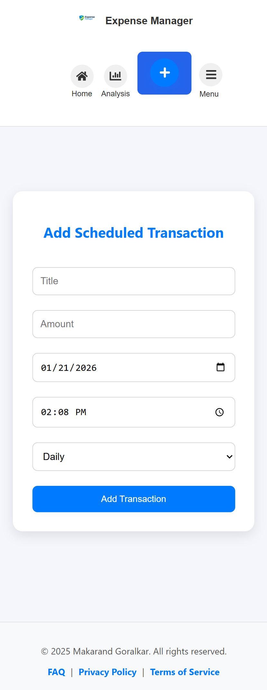


### 👤 Profile & Settings

* **User Profile** – View and update personal details and profile picture

  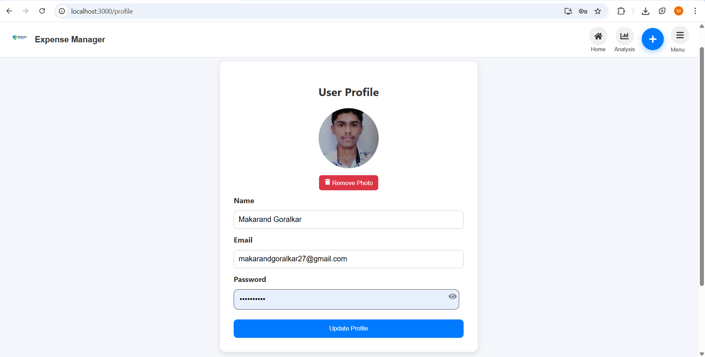


* **Settings & More Options** – App settings, FAQs, About, and Sign Out

  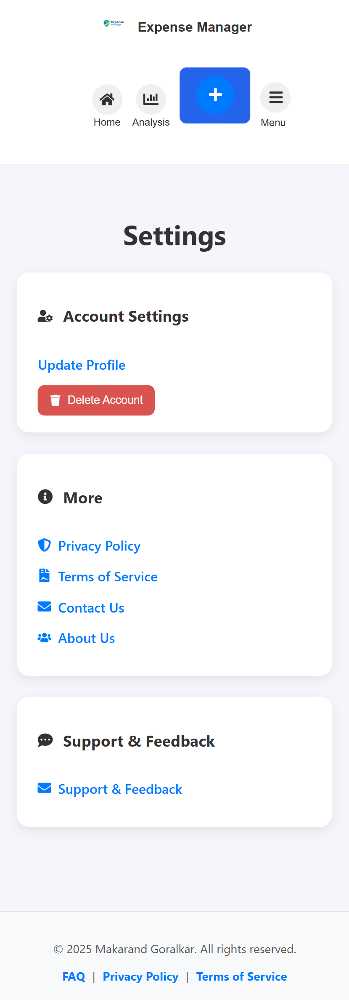


  ### ℹ️ About Page

**About App** – Information about the application and developer  

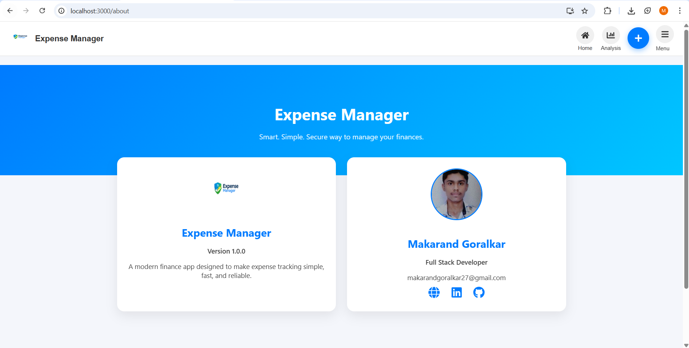


### 📩 Support & Contact

* **Contact Us** – Send queries or messages

 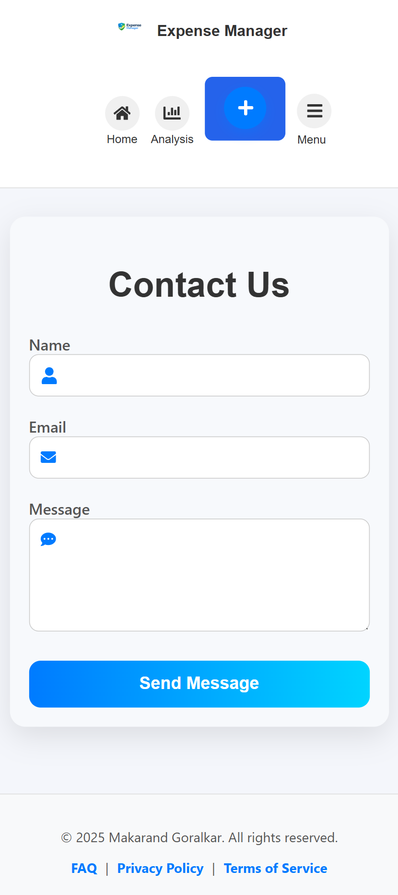


* **Support & Feedback** – Submit support tickets or feedback with attachments

  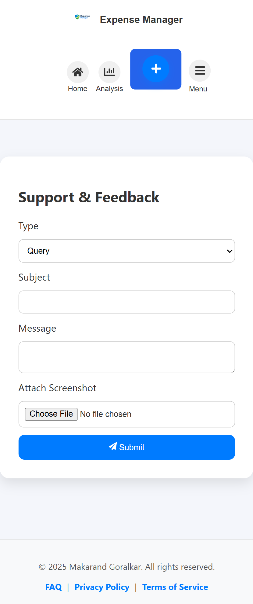

